# PALANOG_WebApp

######## INSTALLATION FOR MY WEB APPLICATION ##############
  
  
  STEP 1: YOU MUST IMPORT THE laurence.sql in localhost.
 
  STEP 2: AFTER YOU UPLOADED THE FILE. THE DATABASE NAME IS "laurence" DATABASE TABLE IS "tbl_lau".
  
  STEP 3: NOW VISIT THIS LINK: http://localhost/Laurence/Lau_cont/main
  
 ---------------------------------------------------------------------------------------------------
 
INSTALLING HADOOP AND HOW HDFS ARCHITECTURE (NameNode and DataNode) WORKS.
 
 First I Installed Java
  
  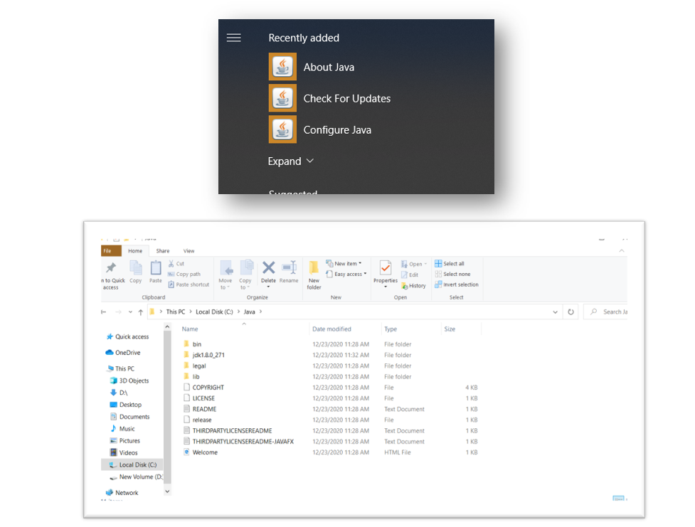
  
  
  And then I Installed Hadoop (Configuring codes in some of Hadoop XML files: core,mapred,yarn,hdfs,Hadoop env. Codes source from Web) and I created Name Node and Data Node in data Folder and in HDFS XML
  
  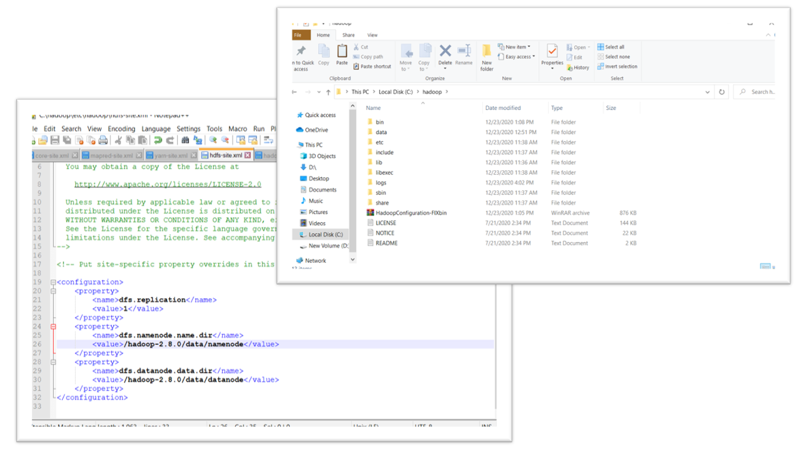
  
  
  
  
                                            CMD CONFIGURE
                                            
                                            
  Checking the Java if it’s already installed (Checking the Java Version)
  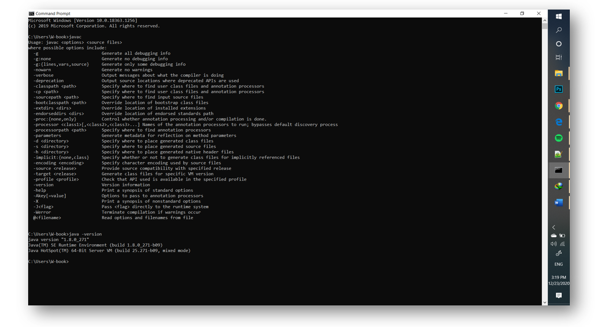
  
  
  Configuring and Creating Namenode (by typing “hdfs name node -format”)
  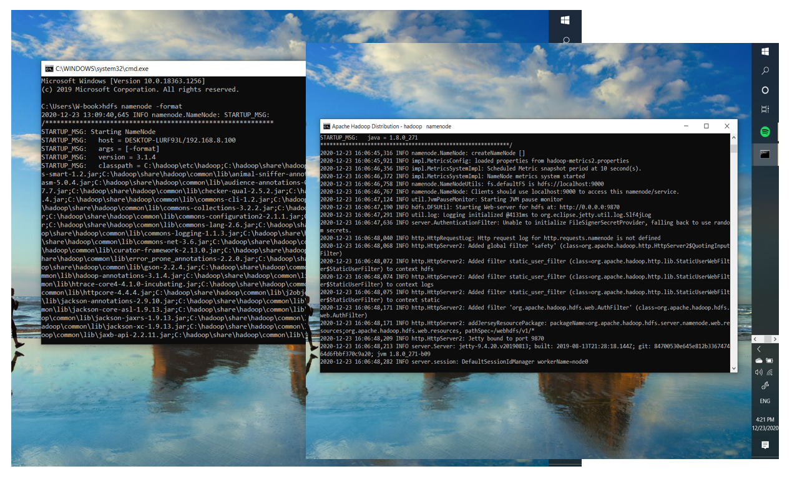
  
  
  
  After creating Name Node starting all cmd in Hadoop sbin by typing “start-all.cmd”
  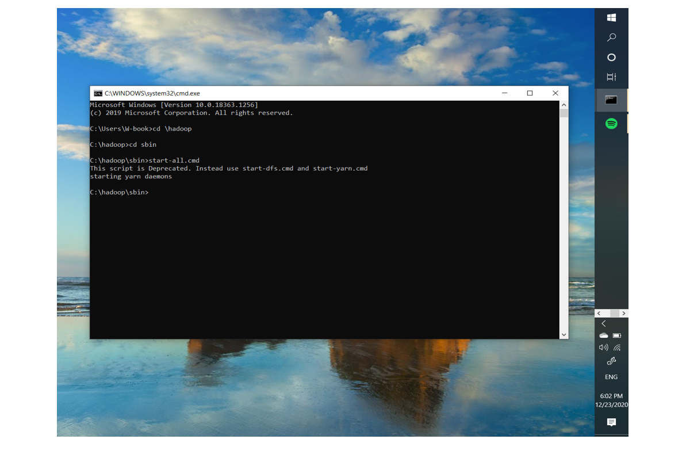
  
  
  To show and start the Data Node
  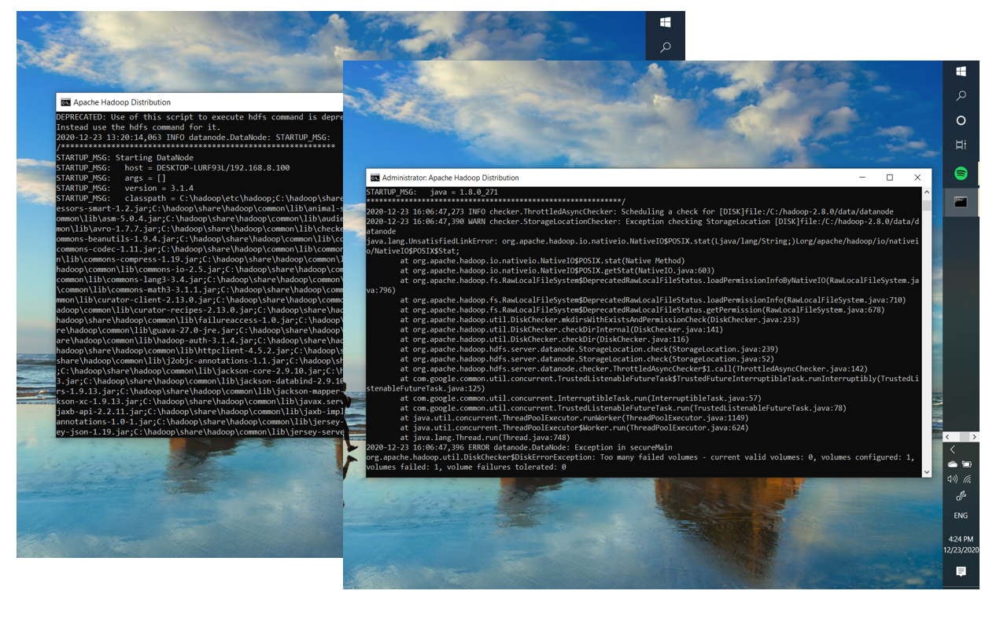
  
  
  Resource Manager
  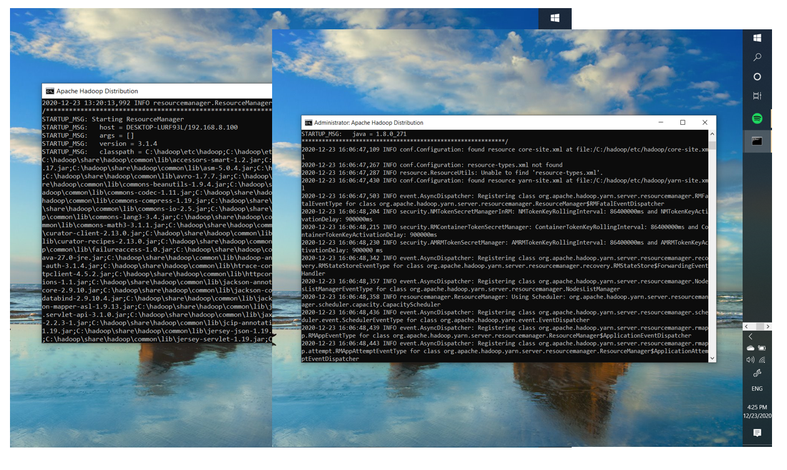
  
  
  And Node Manager
  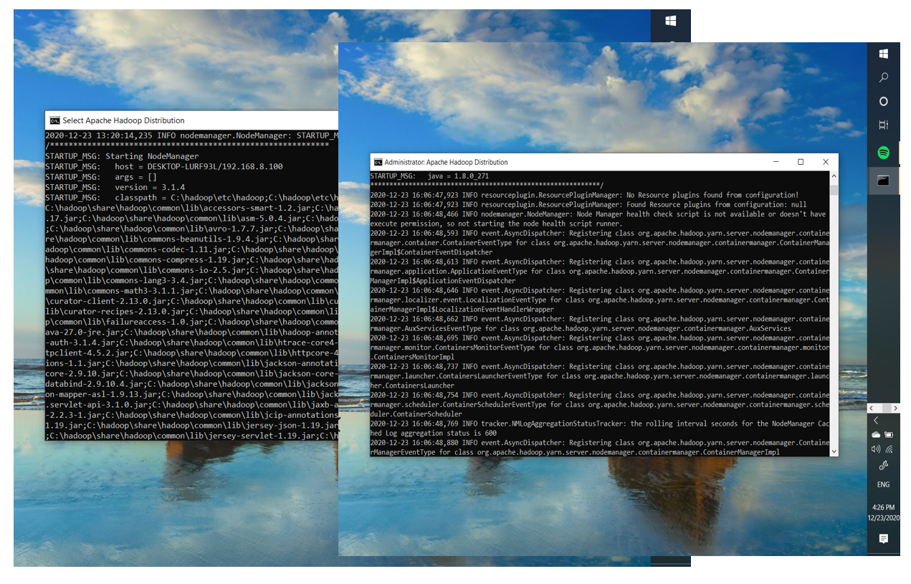
  
  
  
  
  Checking the localhost if the Hadoop has already installed by typing “http://localhost:9870/” but first don’t close all the CMD running (NameNode, DataNode, ResourceManager,NodeManager) so that the localhost link is working.
  
  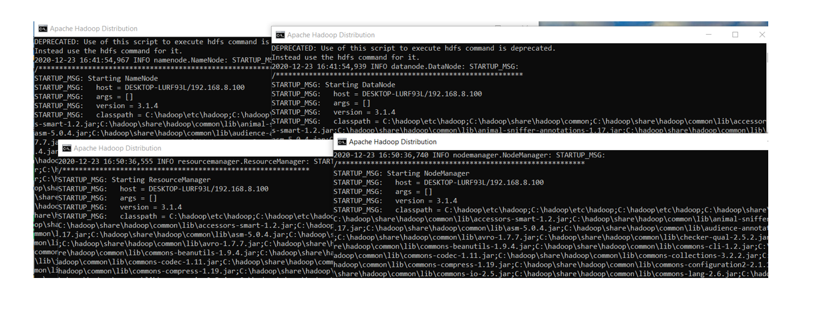
  
  
  
  
  After accessing the localhost link in the web browser you will see this:
  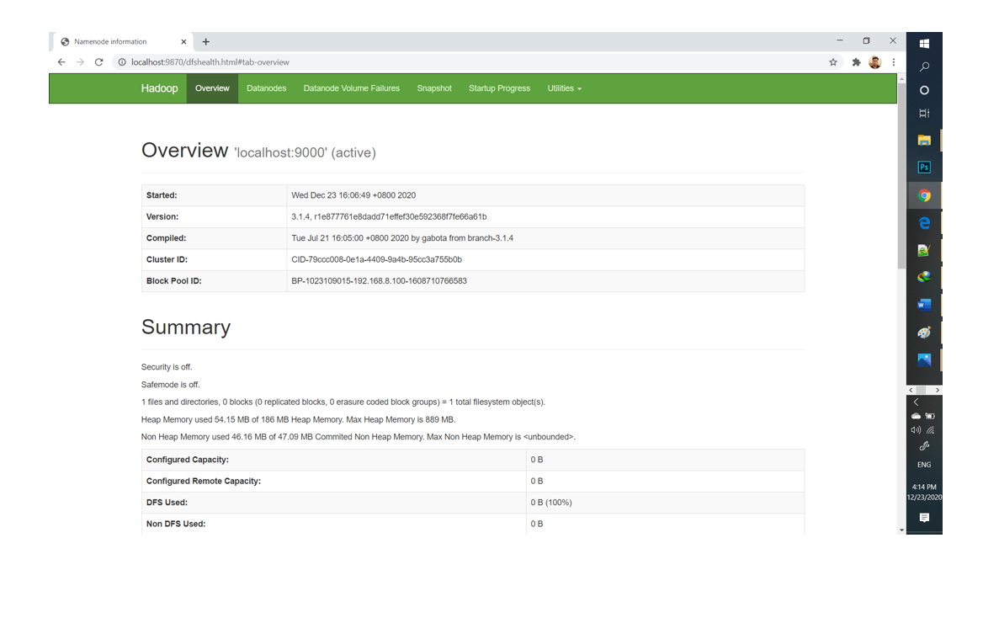
  
  
  SUCCESSFULLY HADOOP HAS BEEN INSTALLED and Name Node and Data Node HAS BEEN CREATED!
  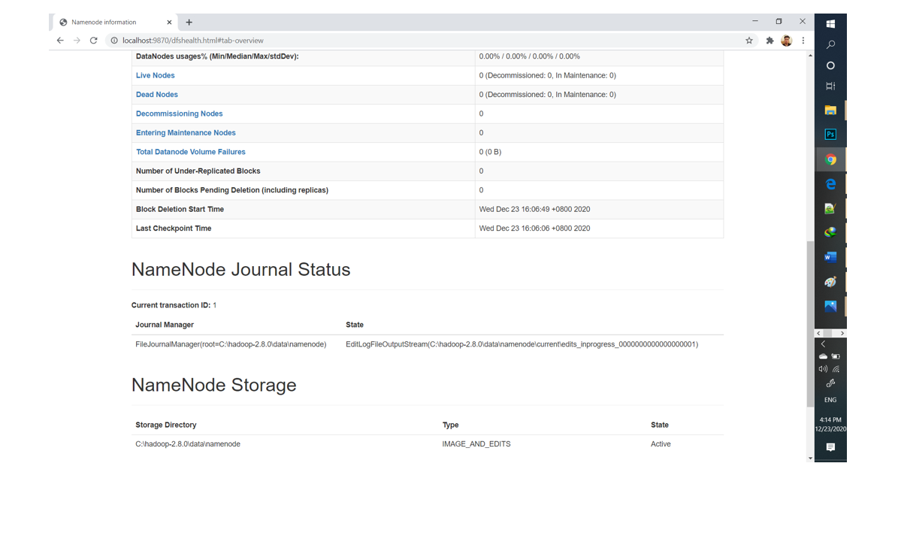
 
  
